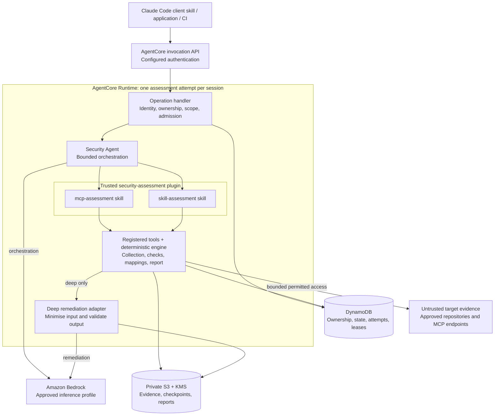
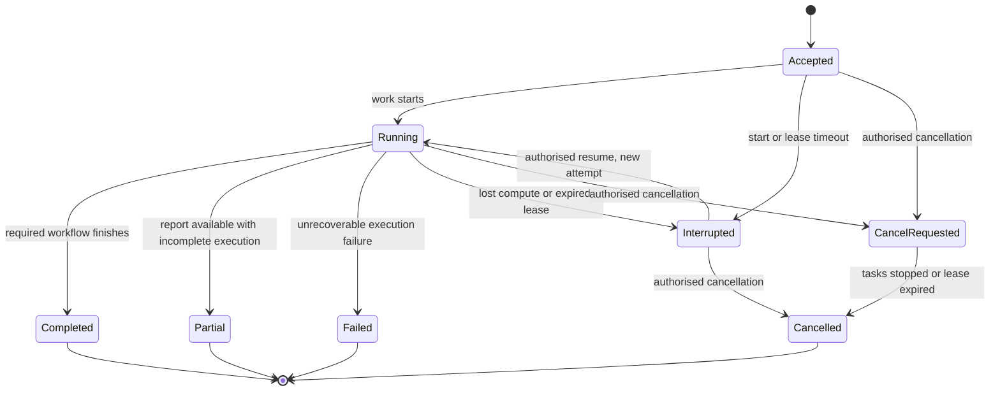

# Security Agent — High-Level Design

**Status:** proposed architecture for review; no agent, scanner, or deployment has been implemented.

**Version:** 0.1

**Audience:** security engineering, application engineering, cloud platform, and architecture reviewers.

**Companion:** [Assessment design and control coverage](assessment-design.md).

## 1. Purpose and architectural direction

Security Agent is an internal service that assesses MCP servers and agent skill packages, records evidence, maps findings to the corporate control catalogue, and produces a report with explicit coverage limitations. It runs on Amazon Bedrock AgentCore Runtime and exposes an authenticated API. Claude Code users invoke the same service through a lightweight client skill.

One maintained agent application loads one trusted `security-assessment` plugin containing two assessment skills:

- `mcp-assessment`: source, configuration, and explicitly permitted endpoint discovery.
- `skill-assessment`: skill instructions, supporting scripts and resources, and relevant containing-plugin configuration, inspected as data.

Both skills use one deterministic assessment engine, evidence model, corporate-control mapping layer, and reporting pipeline. Deep mode adds contextual remediation through an approved Bedrock inference profile. Agent orchestration uses approved Bedrock inference in both modes; authoritative findings come from the deterministic engine.

| Decision | Status |
| --- | --- |
| Product name: Security Agent | Confirmed |
| Production hosting: AgentCore Runtime; API exposure through `InvokeAgentRuntime` | Confirmed |
| One trusted scanner plugin with MCP and skill assessment skills | Confirmed direction |
| Corporate catalogue is the policy authority | Confirmed |
| Approved Bedrock inference; no external scanning SaaS or public model APIs | Confirmed |
| Python engine, AgentCore SDK, S3 artifacts, DynamoDB registry | Proposed implementation |
| Agent framework, authentication integration, AWS regions and service objectives | Open; recommendations and gates appear below |

The earlier EKS hosting proposal is superseded. One agent application may serve many isolated sessions; it does not mean one shared process or conversation for all users.

## 2. Scope and assumptions

Internal and external targets can both supply repository source or configuration. Target ownership, hosting, available evidence, and permitted operations are independent attributes. Source is pinned to an immutable snapshot or revision; endpoint conclusions record whether the source matches the deployed service.

V1 supports individual assessments and batches, including repositories containing both target types. Each target has an explicit ID, type, and evidence scope. A report describes what was assessed and what remains unknown; it is not a blanket guarantee of safety.

Initial assessment activities are static inspection and explicitly authorised MCP discovery. Target scripts, hooks, plugins, package installation, builds, local MCP startup, resource reads, prompt retrieval, and tool execution are outside default permission. Security Agent does not automatically apply remediation. References to other packages or endpoints do not authorise following them.

Approved open-source dependencies are packaged internally. Rules and vulnerability data use reviewed, versioned inputs; external scanning/enrichment services and unapproved model APIs are not runtime dependencies. Explicitly approved repository retrieval and MCP target discovery remain permitted. A representative corporate catalogue has not yet been supplied, so actual control IDs, mappings, and policy thresholds remain to be defined.

## 3. System architecture



The Runtime box is a compute boundary. Its internal modules share the Runtime identity and network configuration; arrows between them do not imply separate IAM roles. S3 and DynamoDB preserve assessment state independently of the session. Approved release artifacts supply scanner skills, rule packs, mappings, and model configuration.

The native API invokes application code; it does not automatically create REST resources such as `/assessments`. AgentCore's HTTP application contract provides `/invocations` and `/ping`. The SDK supplies the serving integration. [AWS HTTP contract](https://docs.aws.amazon.com/bedrock-agentcore/latest/devguide/runtime-http-protocol-contract.html).

### Component responsibilities

| Component | Responsibilities | Authoritative output |
| --- | --- | --- |
| Operation handler | Validate schema, authenticate application identity, authorise targets/results, bind sessions, enforce idempotency and admission | Accepted request and durable operation state |
| Agent and skill loader | Load only pinned scanner skills; interpret scoped requests, invoke registered tools, explain results | Explanations, never replacement findings |
| Two scanner skills | Provide target-specific workflow instructions and reference material | Versioned workflow guidance |
| Collectors and check engine | Retrieve approved evidence, parse bounded inputs, execute registered checks, enforce required phases | Evidence, check results, findings, coverage |
| Control and policy layer | Apply reviewed mappings, applicability, exceptions, and assessment policy | Corporate-control coverage and policy result |
| Remediation adapter | Submit selected evidence to Bedrock; validate structured suggestions and references | Advisory remediation linked to findings |
| Registry and artifact store | Preserve ownership, progress, attempts, immutable evidence and published reports | Recoverable assessment record |
| Claude Code client | Prepare a typed request and retrieve/present the hosted report | No independent scanner verdict |

The agent cannot override the manifest, skip a mandatory phase and publish success, change severity/mappings, or enable remediation in fast mode. Application tools and publication gates enforce those requirements.

## 4. Plugin and skill integration

```text
security-assessment plugin
└── skills/
    ├── mcp-assessment/
    │   ├── SKILL.md
    │   └── references/
    └── skill-assessment/
        ├── SKILL.md
        └── references/

shared application package
├── runtime and agent adapters
├── registered engine tools
├── MCP, skill, and shared check modules
└── controls, reporting, storage, and Bedrock adapters
```

The plugin is a release package, not another agent or container. Select one framework adapter for v1. Strands with its `AgentSkills` integration is a candidate; a Claude Agent SDK adapter is another option when Claude plugin compatibility is required. Avoid maintaining both adapters initially.

The framework must explicitly load the two approved skill directories. Strands loads skill instructions and resource listings while the application provides resource-access tools; it does not interpret a Claude plugin manifest as a deployment. Use registered scanner tools rather than adopting unrestricted shell access from examples. Skill `allowed-tools` metadata is not relied on as an enforcement boundary. [Strands skills](https://strandsagents.com/docs/user-guide/concepts/plugins/skills/).

Keep target repositories outside trusted plugin/skill discovery and never inherit their `SKILL.md`, `AGENTS.md`, `CLAUDE.md`, hooks, or MCP configuration as agent instructions. These files are evidence. The required Claude Code client skill is distributed separately and excluded from the hosted plugin, preventing recursive submission to Security Agent itself. Packaging that client skill in its own plugin is optional.

## 5. Assessment flow and modes

### Main execution flow

```mermaid
sequenceDiagram
    actor Caller
    participant API as Runtime handler
    participant DB as Assessment registry
    participant Agent as Security Agent and controller
    participant Engine as Deterministic engine
    participant S3 as Artifact store
    participant Model as Approved Bedrock profile

    Caller->>API: start_assessment(manifest, idempotency key)
    API->>API: Verify identity, session binding, scope, budgets
    API->>DB: Conditionally create assessment and attempt
    API->>Agent: Register bounded background work
    API-->>Caller: assessment_id and accepted state
    Agent->>Model: Scoped orchestration using trusted skill
    Agent->>Engine: Execute required assessment workflow
    Engine->>S3: Store evidence, findings, coverage, baseline report
    Engine->>DB: Checkpoint phases and renew attempt lease
    opt Deep mode
        Agent->>Model: Minimized findings and control excerpts; no tools
        Agent->>Agent: Validate advisory schema and evidence references
        Agent->>S3: Store separate remediation and deep report
    end
    Agent->>DB: Publish terminal state under current attempt token
    Caller->>API: get_assessment_report(assessment_id)
    API->>DB: Verify ownership and published result references
    API-->>Caller: Structured report or authorised artifact references
```

All model requests use server-configured approved profiles and bounded token/call budgets. A model-generated tool request still passes deterministic scope and phase checks. The remediation call is a separate logical context with no execution tools, even when it uses the same approved model as orchestration.

| Stage | Fast | Deep |
| --- | --- | --- |
| Hosted-agent orchestration | Approved Bedrock inference | Same |
| Evidence collection, checks, mappings and policy | Deterministic | Identical checks for identical captured evidence and versions |
| Remediation | Maintained rule guidance | Additional contextual Bedrock suggestions |
| Output | Findings, coverage, policy result, maintained guidance | Same authoritative results plus separate validated advice |
| Status/report/cancel operations | Structured application logic | Same; no model required |

Claude Code adds its own approved host inference when used as the client. Fast does not mean the full agent workflow is inference-free. Deep does not expand discovery permissions or silently add model-generated security findings.

### Batch example

For a repository with 20 skills, create one assessment containing 20 identified targets and initially run one attempt in one Runtime session. A configurable internal pool might process four targets concurrently; this is a starting example to benchmark, not an AWS limit. Run common repository checks once and link shared findings to affected targets.

Bound target processing and Bedrock concurrency separately. Maintain separate evidence/context bundles per target to avoid mixing conclusions; produce one aggregate report with per-target coverage and failures. A target count of 20 does not cause 20 Runtime environments. On microVM compute, sessions are the execution-environment boundary, and live sessions can serve related invocations. [AWS session model](https://docs.aws.amazon.com/bedrock-agentcore/latest/devguide/runtime-sessions.html).

## 6. API contract

Use typed operations inside the `InvokeAgentRuntime` payload. The following names and fields are proposed application contracts and will be formalised as schemas before implementation.

| Operation | Required intent | Behaviour |
| --- | --- | --- |
| `start_assessment` | Mode, typed targets, evidence references, approved access, idempotency key | Persist acceptance, start bounded work, return assessment ID |
| `get_assessment_status` | Assessment ID | Return state, phase, target counts, incomplete work and errors |
| `get_assessment_report` | Assessment ID and report format | Return only results the caller can access |
| `cancel_assessment` | Assessment ID | Request cooperative cancellation; preserve completed evidence |
| `resume_assessment` | Interrupted assessment ID | Reauthorise access and create a new bounded attempt from valid checkpoints |

Illustrative submission; artifact IDs refer to previously ingested, authorised, immutable snapshots:

```json
{
  "schema_version": "1.0",
  "operation": "start_assessment",
  "idempotency_key": "example-request-001",
  "mode": "deep",
  "targets": [
    {
      "target_id": "mcp-01",
      "target_type": "mcp",
      "evidence_refs": ["artifact-mcp-source-001"]
    },
    {
      "target_id": "skill-01",
      "target_type": "skill",
      "evidence_refs": ["artifact-skill-source-001"]
    }
  ],
  "access": {
    "discovery": "disabled"
  }
}
```

An accepted response contains `assessment_id`, `attempt_id`, and `state: accepted`. HTTP success means the invocation succeeded; it is not a security verdict or proof of completed work. Use an explicit application error/state envelope for validation failures, conflicts, incomplete assessments, and model-stage errors. AWS transport/authentication errors remain distinguishable.

Resolve evidence IDs to owner-scoped storage records. Source ingestion accepts bounded uploaded snapshots or explicitly authorised repository retrieval pinned to a revision. Verify file hashes, extraction limits and path boundaries. A caller's local filesystem path is not a remote evidence reference. The manifest cannot select arbitrary roles, model profiles, commands, network destinations, or trusted scanner skills.

Duplicate requests from the same owner with the same key and input digest return the existing assessment. Conflicting reuse is rejected. Client timeouts must be retried with the original key. Status/report operations remain available after the original compute has stopped by reading durable storage in an authorised invocation.

## 7. Information and control model

| Record | Principal contents |
| --- | --- |
| Assessment | ID, owner/tenant, canonical manifest and digest, mode, state, target counts, versions, budgets, artifact references |
| Attempt | Attempt ID, assessment ID, Runtime session ID, current phase, lease expiry, cancellation, fencing token, failure classification |
| Target | Target ID/type, origin, hosting, approved access, evidence scope, source-to-deployment correspondence |
| Evidence | Immutable artifact reference/hash, source revision, location, collection operation/time, observed/declared/inferred classification |
| Finding | Stable check identity/version, target links, evidence references, severity, confidence, corporate mappings and limitations |
| Coverage | Applicable controls/checks with `pass`, `fail`, `unknown`, `not_applicable`, `error`, or `skipped` and reasons |
| Remediation | Finding/evidence IDs, suggestion, assumptions, verification steps, model/profile/prompt metadata |

Store registry records in DynamoDB and encrypted artifacts in private S3. Separate raw evidence from ordinary report access. Reports reference restricted evidence without embedding credentials or unnecessary source. Define retention, deletion, encryption-key access and backup requirements before production; database TTL alone is not a complete artifact-deletion policy.

Corporate controls determine applicability and policy decisions. Maintain reviewed, versioned many-to-many mappings from checks to controls and relevant external categories. MCP guidance and OWASP MCP categories supplement MCP coverage; skill findings use applicable agentic/software-security categories. Missing mappings and mandatory unknowns remain explicit. No model creates authoritative corporate control IDs.

Capture the repository snapshot, scanner release/image, plugin/skill versions, rule pack, catalogue/mapping versions, prompts, and model settings. Resume uses the same approved snapshot and versions or creates a new assessment if equivalence cannot be preserved.

## 8. Identity and security boundaries

| Boundary | Design requirement |
| --- | --- |
| Caller to API | Validate configured authentication; authorise each operation, target and result |
| Caller to session | Atomically bind an execution session to verified owner, assessment and attempt; check on every invocation before loading agent state or invoking a model |
| Agent to tools | Registered operations only; fixed phase/mode gates, resource bounds and target-specific permissions in code |
| Trusted scanner to target evidence | Explicit trusted loader paths; target packages remain inert and cannot register tools, skills or hooks |
| Runtime to AWS/data stores | Least-privilege execution role, scoped storage/secret operations, encryption and audit |
| Runtime to targets | Explicit destinations/operations, TLS, redirect/DNS validation, bounded pagination and responses |
| Evidence to model | Selected redacted content, relevant control excerpts, bounded context; raw content is untrusted |
| Model to findings | Schema/reference validation; generated text cannot overwrite deterministic findings or policy |

Proposed default authentication is corporate JWT for both user clients and approved machine identities, subject to identity-provider support. Configure issuer, audiences, scopes and verified principal propagation. If the handler needs the bearer token, explicitly configure supported header forwarding and validation; do not assume identity claims appear automatically in the payload. An IAM/SigV4 alternative needs an equally explicit trusted ownership mechanism. One Runtime configuration uses the selected inbound authentication mode; do not assume IAM and JWT are interchangeable on the same configuration. [AWS inbound authentication](https://docs.aws.amazon.com/bedrock-agentcore/latest/devguide/runtime-oauth.html).

Session IDs, assessment IDs, body `owner_id` fields and caller-supplied user headers are not authorisation. Derive a user principal from verified issuer/subject and an approved tenant claim; define an equivalent machine-principal convention for CI. Bind execution sessions to `(owner, assessment_id, attempt_id)`. Reject a different start/resume in an already-bound execution session; idempotent replay of the same request returns the existing assessment. Authorised status/report access can use a fresh control invocation without loading unrelated agent context. Reject mismatched session ownership before any state reuse. Ordinary callers receive assessment invocation permissions, not Runtime shell/command access. The authenticated caller's target entitlement is checked independently of the scanner's ability to obtain target credentials.

Keep caller JWTs out of model context, logs, stored manifests and target requests. Accepted background work runs under an explicit, bounded assessment authorisation record and service identity rather than a persisted caller token. Define authorisation expiry/revocation checks at phase boundaries; expired grants interrupt work until reauthorised. Resume and result access always validate current caller rights. Target credentials have a separate scope and refresh policy.

Collectors, parser subprocesses, orchestration and remediation inside one session share the Runtime role, network and filesystem. The microVM isolates compute sessions; it does not provide per-module or per-assessment S3 permissions under a shared role. Fast/deep separation is enforced in application code. If corporate policy requires stronger phase/tenant isolation, split execution across constrained Runtime deployments or an approved broker before production. This is an explicit security decision, not a property supplied by skill packaging.

Configure Runtime connectivity to approved private resources and AWS endpoints. Inbound private API connectivity and outbound access to internal targets are separate network decisions. External discovery uses controlled egress; reject unintended internal/link-local destinations and revalidate redirects and DNS results. VPC attachment is not a hostname allowlist. [AWS VPC connectivity](https://docs.aws.amazon.com/bedrock-agentcore/latest/devguide/agentcore-vpc.html).

Bedrock requests use a server-selected approved inference profile, including orchestration. Validate region routing, logging and data-retention settings against corporate requirements. The profile is used in the model invocation configuration; hosting in AgentCore does not automatically configure it. [Bedrock inference profiles](https://docs.aws.amazon.com/bedrock/latest/userguide/inference-profiles-use.html).

## 9. Lifecycle, resilience and concurrency



Lifecycle state is separate from security outcome: `Completed` can contain failed checks or unknown controls. A deep-mode inference failure leaves deterministic results accessible and marks the advisory stage incomplete, normally producing `Partial`. Each target also records its own phase and outcome.

Persist acceptance before acknowledgement. Register background work and keep health responses responsive. The AgentCore SDK's asynchronous tracking communicates activity so work can continue after the initial response; it is not a durable queue or replay engine. Busy health prevents idle termination, not maximum-lifetime termination or crashes. [AWS asynchronous processing](https://docs.aws.amazon.com/bedrock-agentcore/latest/devguide/runtime-long-run.html).

Checkpoint at phase/target boundaries and renew a conditional attempt lease. Only the current fencing token can publish canonical result references; stale attempts may leave orphan artifacts for cleanup but cannot replace published state. Cancellation and completion compete through conditional state transitions so a late result cannot overwrite an accepted cancellation. Timeouts and subprocess termination bound cancellation latency, although an external inference request may already be in flight.

V1 uses explicit recovery: status evaluation detects expired leases or accepted-but-not-started work, reports interruption, and permits authorised resume. Reauthorise current access and verify checkpoints before replay. Retries may repeat discovery or inference; exactly-once external effects are not promised. A scheduled reconciler may later automate this control-plane work while all scanning remains in AgentCore.

Enforce admission limits per owner, target and service, plus per-attempt parsing, bytes, pages, runtime and inference budgets. When capacity is unavailable, return a retryable admission error before accepting work. SQS/dispatcher integration is optional for future burst buffering. Set scan deadlines below the configured Runtime lifetime, and validate current regional quotas during deployment.

## 10. Deployment and operations

| Layer | Proposed technology |
| --- | --- |
| Runtime application | Python, Pydantic contracts, AgentCore SDK; one pinned skill-capable agent framework |
| Scanner execution | Registered Python check modules and reviewed offline subprocess adapters where useful |
| MCP collection | Official MCP SDK adapter selected for supported protocol revisions |
| Model access | Approved Bedrock inference profile through the model adapter |
| Durable state | DynamoDB assessment/attempt registry |
| Artifacts | Private S3 with KMS encryption and controlled retention |
| Secrets | Approved AWS secret storage/identity integration, using references rather than embedded credentials |
| Release | Reviewed source and skills, immutable ECR image, pinned rule/catalogue artifacts, infrastructure as code |
| Telemetry | Structured operational logs, metrics and traces in approved AWS monitoring services |

Use separate development, test and production configuration with least-privilege identities. Build and validate scanner dependencies, produce provenance/SBOM metadata, and promote the same immutable application/plugin/rule release. Do not hot-load changed remote skills or rule code during a scan. Existing attempts retain their pinned release; rollbacks apply through controlled Runtime version/endpoint selection.

Log assessment/attempt IDs, phase transitions, elapsed time, error classes, artifact hashes, model usage and rule versions. Exclude credentials, raw source, target responses and full prompts by default. Record authorisation failures, budget exhaustion, stale attempts, model-stage failures, and report access. Restrict access to traces that may contain sensitive content.

| Operational objective | Verification approach |
| --- | --- |
| Reproducibility | Same captured evidence and pinned rules produce equivalent deterministic findings |
| Isolation | Cross-owner session/status/report access is rejected before context reuse |
| Reliability | Lost responses, duplicate submits and killed sessions preserve honest durable state |
| Bounded execution | Hostile archives, parsers, endpoints and model responses remain within configured limits |
| Performance/cost | Benchmark small, large and 20-target batches; cap inference and task concurrency separately |
| Availability and recovery | Agree numeric service objectives and recovery ownership before production |

MCP Inspector can remain an optional approved diagnostic adapter. It is not required for the production engine or used as the policy verdict. AgentCore Gateway, Memory, a vector database, a browser UI, and a separate scanner MCP server are not required by this HLD.

## 11. Delivery and validation

1. **Contracts and fixtures:** target/evidence/result schemas, representative corporate controls, versioned rule interfaces, benign/vulnerable MCP and skill fixtures.
2. **Assessment core:** static checks, permitted discovery, deterministic findings/coverage, shared control mapping, report output.
3. **Hosted agent:** two trusted skills, framework adapter, approved model configuration, registered tools and enforced phase boundaries.
4. **Service integration:** AgentCore invocation/authentication, storage, admission, leases, cancellation, resume and thin Claude Code client.
5. **Pilot:** validate mixed batches, malicious skill instructions, target permission boundaries, failure recovery, data handling, performance and cost.

Release criteria include verified skill loading from the trusted package; no target activation/execution; equivalent deterministic results across clients; no deep remediation in fast mode; faithful findings under prompt-injection attempts; correct coverage for missing evidence; rejected cross-owner access; safe retries and stale-attempt fencing; and graceful partial reports when deep inference fails. These are planned tests, not claims of validation already performed.

## 12. Open decisions before production

| Decision | Required input |
| --- | --- |
| Corporate policy | Catalogue sample/format, control mappings, severity, mandatory unknowns, exceptions |
| Agent implementation | Framework/loader selection and approved dependency/runtime versions |
| Identity | JWT or IAM integration, machine callers, session binding and verified ownership propagation |
| Evidence and targets | Approved ingestion process, MCP revisions/transports, skill/plugin dialects, credentials and allowlists |
| Isolation | Whether a shared execution role satisfies phase/tenant requirements |
| Bedrock | Approved model/profile, regions, residency, logging, token budgets and fallback policy |
| Operations | Batch/concurrency/runtime limits, service objectives, support ownership, explicit versus automatic recovery |
| Data lifecycle | Classification, redaction, retention/deletion, backup/restore and report access |
| Supply chain | Internal vulnerability feed, update cadence, plugin/rule promotion and reassessment triggers |

The [detailed assessment design](assessment-design.md) records scanner coverage, rule contracts, and further implementation considerations. This HLD defines the overall Security Agent architecture and its review boundaries.
