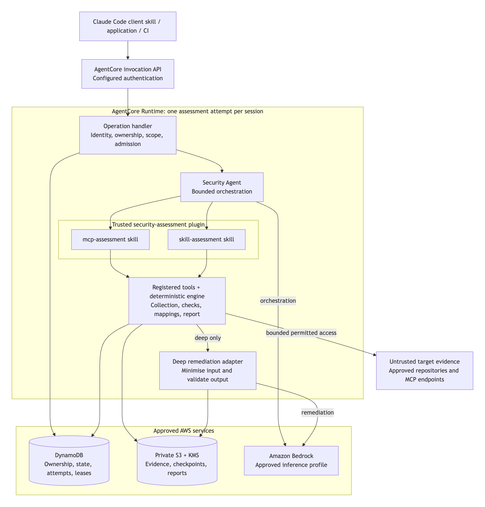
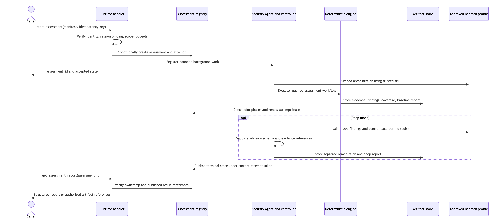
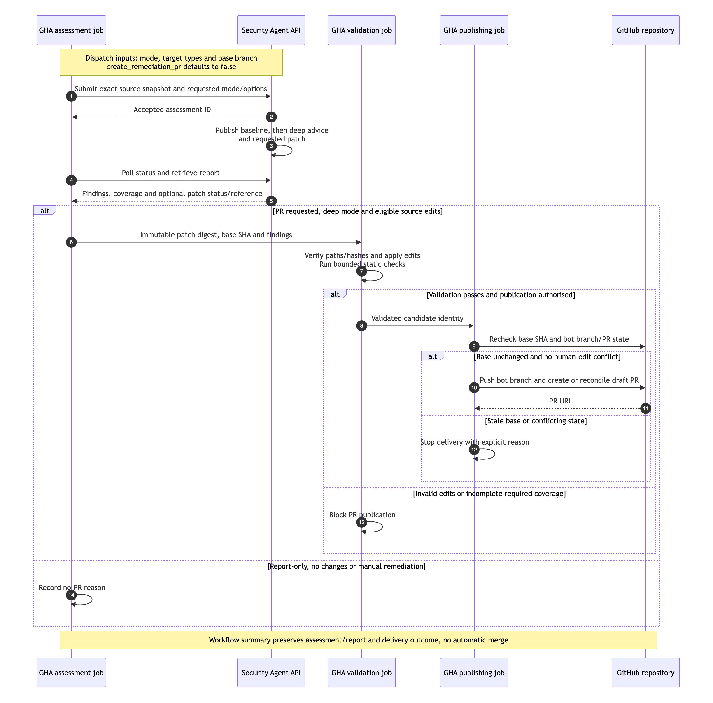
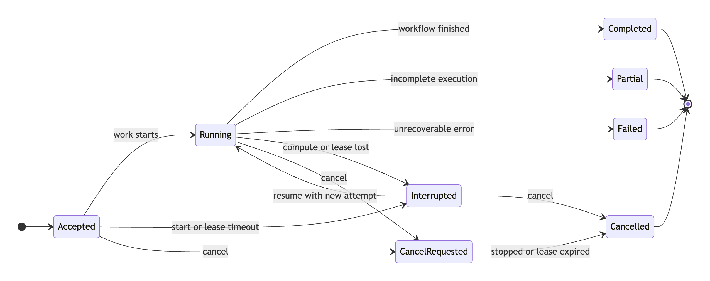
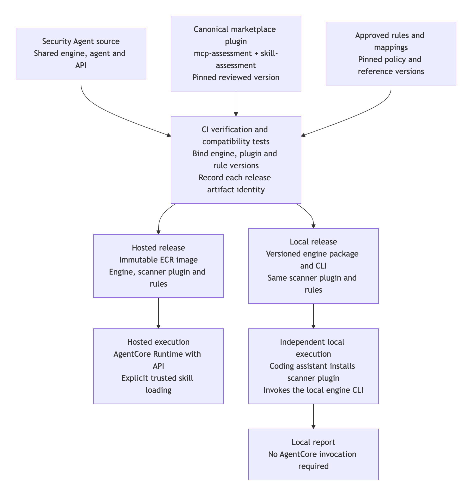

# Security Agent — High-Level Design

**Status:** proposed architecture for review; no agent, scanner, or deployment has been implemented.

**Version:** 0.6 — updated 21 September 2026

**Audience:** security engineering, application engineering, cloud platform, and architecture reviewers.

**Companion:** [Assessment design and control coverage](assessment-design.md).

This document defines shared architecture, delivery, API, lifecycle and persistence decisions. The companion design expands assessment coverage, rules and evidence requirements under those decisions. Update both when a shared contract changes; additional detail must not redefine that contract.

## 1. Purpose and architectural direction

Security Agent assesses MCP servers and agent skill packages, records evidence, maps findings to the corporate control catalogue, and produces a report with explicit coverage limitations. It supports two execution backends: a hosted agent on Amazon Bedrock AgentCore Runtime with an authenticated API, and direct local execution of the scanner plugin in an approved compatible coding assistant. Local execution uses an installed shared engine and does not invoke AgentCore. An optional client plugin can submit work to the hosted API instead.

One canonical trusted `security-assessment` plugin supplies two assessment skills to the hosted agent or a compatible local assistant:

- `mcp-assessment`: source, configuration, and explicitly permitted endpoint discovery.
- `skill-assessment`: skill instructions, supporting scripts and resources, and relevant containing-plugin configuration, inspected as data.

Both skills use the same versioned deterministic engine implementation, evidence model, corporate-control mapping layer, and reporting pipeline. Each backend runs its own engine instance. Deep mode adds contextual remediation through an approved Bedrock inference profile. The selected local assistant or hosted agent uses approved Bedrock orchestration in both modes; authoritative findings come from the deterministic engine.

The organisation already has a central plugin marketplace for skills and MCP packages or connection definitions. Use it to distribute the canonical scanner plugin for local installation and hosted release composition, plus an optional separate hosted-API client plugin. The application release produces the engine package used locally and in the Security Agent image. Marketplace packages submitted for assessment remain untrusted evidence even when the same marketplace distributes the trusted scanner.

| Decision | Status |
| --- | --- |
| Product name: Security Agent | Confirmed |
| Hosted service: AgentCore Runtime; API exposure through `InvokeAgentRuntime` | Confirmed |
| Direct local scanner-plugin execution without AgentCore invocation | Confirmed direction |
| One API and assessment lifecycle for MCP, skill, and mixed batches | Confirmed direction |
| One trusted scanner plugin with MCP and skill assessment skills | Confirmed direction |
| Existing corporate plugin marketplace | Confirmed organisational context |
| Separate agent and scanner-plugin source repositories; marketplace distributes the plugin | Confirmed direction |
| Optional remediation PR for source repositories assessed from GitHub Actions, selected by a workflow-dispatch parameter | Confirmed requirement; proposed delivery contract below |
| Pinned scanner plugin plus compatible local engine package, or hosted container image | Proposed v1 delivery model |
| Corporate catalogue is the policy authority | Confirmed |
| Approved Bedrock inference; no external scanning SaaS or public model APIs | Confirmed |
| Hosted state database: Amazon Aurora PostgreSQL | Confirmed direction |
| Hosted SQL access through RDS Data API over HTTPS | Selected design for API-based database access |
| Python engine, AgentCore SDK, S3 artifacts | Proposed implementation |
| Agent framework, authentication integration, AWS regions and service objectives | Open; recommendations and gates appear below |

The earlier EKS hosting proposal is superseded for the hosted service. Direct local execution is an additional supported delivery path. One hosted agent application may serve many isolated sessions; it does not mean one shared process or conversation for all users.

## 2. Scope and assumptions

Internal and external targets can both supply repository source or configuration. Target ownership, hosting, available evidence, and permitted operations are independent attributes. Source is pinned to an immutable snapshot or revision; endpoint conclusions record whether the source matches the deployed service.

V1 supports individual assessments and batches, including repositories containing both target types. Each target has an explicit ID, type, and evidence scope. A report describes what was assessed and what remains unknown; it is not a blanket guarantee of safety.

### Four assessment entry points

Support the following scenarios through three collection adapters and the existing two scanners. Collection location is independent of where checks run; collecting workstation evidence locally does not require running the assessment in AgentCore.

| Scenario | Collection and inventory | Assessment and limits |
| --- | --- | --- |
| Repository containing skills | Repository adapter captures one immutable snapshot, inventories selected `SKILL.md` packages and relevant plugin context | Skill checks inspect instructions, supporting files, scripts and dependencies as data; shared files are assessed once with links to affected skills |
| MCP source repository | The same repository adapter identifies server packages through explicit paths and supported manifest/code patterns | MCP checks inspect implementation, configuration and dependencies; ambiguous candidates and missing deployment evidence remain visible |
| MCP endpoint | Endpoint adapter uses an explicit URL, approved network location, transport/revision support and discovery grant | Bounded protocol discovery/listing and observable controls; inaccessible implementation and untested runtime controls remain unknown |
| Skill or MCP installed in a CLI | Local installation adapter snapshots selected package files and relevant host configuration without loading them | Route installed skills to skill checks and MCP definitions/packages to MCP checks; installed HTTP MCPs can add separately authorised endpoint discovery, while stdio MCPs remain static-only in v1 |

Keep three concepts separate: `input_kind` identifies `repository`, `mcp_endpoint` or `cli_installation`; `target_type` remains `skill` or `mcp`; evidence is a set that can contain source, installed files, configuration and endpoint observations together. One input can produce many targets. Multiple evidence inputs can support a target only through an explicit association with recorded correspondence; a matching name is insufficient. The [detailed intake contract](assessment-design.md#four-scenarios-and-intake-contract) defines resolution and evidence handling.

The local engine package supplies the CLI installation collector, initially for a pinned, supported Claude Code version range. It reads authorised host records and package roots using a versioned adapter, records scope/enabled/shadowed state and configuration provenance, and snapshots the actual installed bytes. It does not start the assistant being inspected, execute target launch commands, refresh a marketplace or contact discovered endpoints automatically. Unsupported host/version semantics or unavailable package bytes yield explicit coverage limitations. Additional CLIs require their own validated adapters.

Run that collector directly or from a clean scanner assistant process/profile that loads only approved scanner components. A neutral project directory alone does not suppress user-wide target plugins or MCPs. Read the original profile as evidence without changing its settings; if the host cannot prevent target activation in the scanner process, use the standalone engine CLI. A scan cannot undo target activity that occurred in a user's existing session.

AgentCore cannot read a caller's filesystem or reach their loopback services. For central assessment of installed targets, explicitly collect and export a bounded, sanitised evidence bundle locally, use the authenticated ingestion operations in section 6, and submit the resulting immutable evidence reference. Hosted checks re-evaluate the supplied evidence; they do not accept a local verdict as authoritative. A checksum establishes bundle integrity, not that the workstation supplied a complete or truthful inventory. Report its provenance and exclusions. There is no automatic workstation upload or implicit import of local reports.

Endpoint collection can run locally or from Runtime only where the approved network path exists. Never reinterpret a workstation's `localhost` as Runtime's `localhost`, create a tunnel, or start a configured server to satisfy a request. An explicitly allowed local HTTP endpoint may be collected locally and its captured observations exported; the hosted report labels them as client-collected evidence with capture time and access context. Missing source for installed binaries and unverified source-to-installation/deployment correspondence remain unknown.

V1 assessment activities are static inspection and explicitly authorised MCP discovery/listing. Activating target scripts, hooks or plugins, installing target packages, running builds, starting target MCPs, reading MCP resources, retrieving prompts and invoking target tools are outside v1 scope. A discovery permission does not enable those activities; any future behavioural-testing capability needs a separate explicit contract. Runtime does not write to assessed repositories or deployments. For source assessments, an explicitly selected GitHub Actions workflow can apply validated proposed edits to a new branch and open a draft PR as described in section 6; merging remains a repository review decision. References to other packages or endpoints do not authorise following them.

Approved open-source dependencies are packaged internally. Rules and vulnerability data use reviewed, versioned inputs; external scanning/enrichment services and unapproved model APIs are not runtime dependencies. Explicitly approved repository retrieval and MCP target discovery remain permitted. A representative corporate catalogue has not yet been supplied, so actual control IDs, mappings, and policy thresholds remain to be defined.

## 3. System architecture

This diagram shows the hosted backend. The local backend uses the same scanner plugin and engine implementation through the local adapter described in section 4; it does not traverse this API or Runtime.



[Open full-size diagram](diagrams/system-architecture.png) · [Editable diagram source](diagrams/system-architecture.mmd)

The Runtime box is a compute boundary. Its internal modules share the Runtime identity and network configuration; arrows between them do not imply separate IAM roles. Aurora PostgreSQL preserves assessment state independently of the session; S3 preserves evidence and report artifacts. The hosted application executes SQL through RDS Data API over HTTPS, using an approved private endpoint for the selected VPC deployment. Approved release artifacts supply scanner skills, rule packs, mappings, and model configuration.

The native API invokes application code; it does not automatically create REST resources such as `/assessments`. AgentCore's HTTP application contract provides `/invocations` and `/ping`. The SDK supplies the serving integration. [AWS HTTP contract](https://docs.aws.amazon.com/bedrock-agentcore/latest/devguide/runtime-http-protocol-contract.html).

### Collector coverage

For Security Agent, the planned collectors already cover the required paths:

| Scenario | Required component |
| --- | --- |
| Skill repository | Repository collector and skill checks |
| MCP source repository | Repository collector and MCP checks |
| MCP endpoint | Bounded MCP SDK client |
| Installed CLI skill/MCP | Local installation collector, with separately authorised endpoint discovery |

### Component responsibilities

| Component | Responsibilities | Authoritative output |
| --- | --- | --- |
| Operation handler | Validate schema, authenticate application identity, authorise targets/results, bind sessions, enforce idempotency and admission | Accepted request and durable operation state |
| Agent and skill loader | Load only pinned scanner skills; interpret scoped requests, invoke registered tools, explain results | Explanations, never replacement findings |
| Two scanner skills | Provide target-specific workflow instructions and reference material | Versioned workflow guidance |
| Collectors and check engine | Retrieve approved evidence, parse bounded inputs, execute registered checks, enforce required phases | Evidence, check results, findings, coverage |
| Control and policy layer | Apply reviewed mappings, applicability, exceptions, and assessment policy | Corporate-control coverage and policy result |
| Remediation adapter | Submit selected evidence to Bedrock; validate structured suggestions and optionally requested source edits | Advisory remediation and proposed patch artifact linked to findings |
| Registry and artifact store | Preserve ownership, progress, attempts, immutable evidence and published reports | Recoverable assessment record |
| Local assistant and engine adapter | Load the scanner plugin, invoke the installed engine, and present local results | The same deterministic finding contract from local execution |
| Optional hosted API client | Prepare a typed request and retrieve/present the hosted report | No separate scanner verdict |

The agent cannot override the manifest, skip a mandatory phase and publish success, change severity/mappings, or enable remediation in fast mode. Application tools and publication gates enforce those requirements.

## 4. Application, plugin, and skill packaging

### Source ownership and application package

Maintain the executable engine, API and runtime adapters in the Security Agent application repository. Maintain the canonical `security-assessment` plugin and its two skills in a separate scanner-plugin source repository. The corporate marketplace catalogues and distributes approved plugin releases from that repository. The application consumes a pinned release; it does not maintain a second editable copy of those skills. Agent and plugin revisions are independent and are bound together by the tested release manifest.

| Component | Source of truth | Deployment role |
| --- | --- | --- |
| API, agent adapter, registered tools, deterministic engine | Security Agent application repository | Hosted image and a separately installable engine package/local CLI |
| `security-assessment` plugin with both scanner skills | Separate scanner-plugin source repository | Marketplace distributes the same pinned bundle for local installation and hosted image composition |
| Optional hosted-API client plugin | Separate package in the plugin repository, distributed through the marketplace | Terminal submission to the hosted service; excluded from hosted skill loading |
| Corporate catalogue, mapping data, rule metadata | Approved versioned internal configuration/artifact storage | Pinned inputs with recorded hashes and access controls |
| Packages or repositories under assessment | Supplied artifacts or explicitly approved retrieval | Evidence only; never part of trusted discovery |

Proposed application layout; scanner plugin source lives in its separate repository as shown in the [companion package layout](assessment-design.md#4-proposed-package-structure). The following packages have not yet been implemented:

```text
security-agent/
├── src/security_agent/
│   ├── runtime/                 # API, identity, assessment lifecycle
│   ├── agent/                   # Framework adapter and registered tools
│   ├── cli/                     # Local adapter invoking the same engine
│   ├── engine/
│   │   ├── pipeline.py          # Required phases, budgets, scheduling
│   │   ├── collectors/          # Repository, endpoint, local CLI installation
│   │   │   └── hosts/           # Versioned host readers; initial Claude Code adapter
│   │   ├── inventory/           # Targets, files, shared dependencies
│   │   ├── checks/
│   │   │   ├── shared/
│   │   │   ├── mcp/
│   │   │   └── skills/
│   │   ├── controls/            # Mapping and policy evaluation code
│   │   └── reporting/           # Findings, evidence, coverage
│   ├── storage/                 # Local files or hosted durable storage
│   └── remediation/             # Bounded Bedrock advisory adapter
├── deployment/                  # Image build, IaC, release lock data
├── packaging/                   # Local engine package distribution
├── integrations/github/         # Trusted workflow templates and delivery helpers
├── control-mappings/            # Schemas and sanitised examples
├── schemas/                     # Shared assessment and tool contracts
├── assets/                      # Report templates
└── tests/                       # Fixtures and expected results
```

The mapping code applies reviewed rule-to-control relationships supplied as versioned YAML/JSON or equivalent structured data. Confidential catalogue content stays in approved private storage. Record the catalogue, mappings, policy and rule versions used by every assessment; the LLM cannot create authoritative control IDs or replace mapping decisions.

### Local and hosted execution backends

Backend selection (`local` or `hosted`) is independent of analysis mode (`fast` or `deep`). Both backends support both modes. Select the backend in trusted host/deployment configuration and record it in the assessment manifest; target content cannot change it.

| Concern | Direct local execution | Hosted execution |
| --- | --- | --- |
| Orchestration host | Approved compatible coding assistant, initially Claude Code | Security Agent application in AgentCore |
| Scanner skills | Canonical marketplace scanner plugin installed locally | Pinned release of that same plugin in the image |
| Engine invocation | Approved CLI or local tool adapter for the installed engine | Registered application tool calling the engine |
| Evidence | Approved local snapshot or bounded permitted retrieval/discovery | Authorised artifact references or permitted retrieval/discovery |
| Records and reports | Access-controlled local run directory by default | Aurora PostgreSQL registry via RDS Data API, and private S3 artifacts |
| Model inference | Approved assistant configuration; approved Bedrock adapter for deep remediation | Approved Bedrock orchestration and deep remediation |
| AgentCore invocation | None | Required to submit to the hosted service |

A plugin containing only instructions is insufficient when its workflow requires engine tools. Distribute a pinned engine package with its supported CLI and dependencies through an approved internal package source, and validate plugin/tool-contract compatibility before a scan. A Python package with a CLI entry point is the proposed local artifact; installation format and supported OS/architectures remain to be selected. No AgentCore daemon, local HTTP server, S3 bucket or Aurora database is required for the direct local path.

Maintain one workflow contract and common engine code. The local adapter converts validated CLI/tool arguments into the same assessment context used by hosted registered tools; it invokes the installed scanner executable, never a command supplied by the target repository. Required checks, mode gates, scope limits and result validation remain in the engine. Missing dependencies or unsupported capabilities produce explicit setup/coverage errors rather than silent fallback to the hosted API or model-only assessment.

Record equivalent evidence, applicability context, engine/plugin/rule/catalogue versions and limits to compare deterministic outputs across backends. OS, tool availability and live evidence can affect coverage; record such differences rather than claiming unconditional identical results. Model suggestions may differ. Local execution does not mean offline execution: assistant inference, deep remediation, approved configuration retrieval and permitted MCP discovery may still use the network. Configure Claude Code's inference through approved Bedrock settings. [Claude Code skills](https://code.claude.com/docs/en/skills), [Bedrock configuration](https://code.claude.com/docs/en/amazon-bedrock).

### Deployed filesystem and trusted loading

The proposed hosted image contains separate application and trusted-plugin paths:

```text
/app/security-agent/                         # Installed application and engine
/opt/security-agent/trusted-plugins/
└── security-assessment/
    └── skills/
        ├── mcp-assessment/SKILL.md
        └── skill-assessment/SKILL.md
/work/assessments/<assessment-id>/            # Target evidence and temporary work
```

Package each selected skill with its reviewed references and required support files. Configure trusted-plugin files as read-only to the runtime user and keep evidence paths outside all plugin/skill discovery roots. Separate folders support controlled loading and maintenance; they do not create separate IAM, process, or network security boundaries. Loaded scanner skills intentionally guide the agent. Application code enforces what their tools can do.

The plugin is a release package, not another agent or container. Select one hosted agent-framework adapter for v1. Strands with its `AgentSkills` integration is a candidate; a Claude Agent SDK adapter is another option when Claude plugin compatibility is required. Avoid maintaining both hosted frameworks initially. The local assistant's plugin/CLI integration remains a separate supported interface and does not require the hosted framework.

The framework must explicitly load the two approved skill directories. Strands loads skill instructions and resource listings while the application provides resource-access tools; it does not interpret a Claude plugin manifest as a deployment. Use registered scanner tools rather than adopting unrestricted shell access from examples. Skill `allowed-tools` metadata is not relied on as an enforcement boundary. [Strands skills](https://strandsagents.com/docs/user-guide/concepts/plugins/skills/).

The Claude Agent SDK can load a plugin from an explicitly configured local directory after the deployment pipeline downloads it. Such a plugin can also contain hooks, subagents and MCP definitions. For the hosted scanner, validate a skills-only component allowlist and reject unapproved executable components, hooks, automatic MCP connections, and client helpers. A different folder does not suppress those components when a framework loads the whole plugin. Marketplace distribution and loading are implemented by the release pipeline and selected framework adapter; the design does not assume a native AgentCore marketplace-attachment feature. [Claude Agent SDK plugins](https://code.claude.com/docs/en/agent-sdk/plugins).

Keep target repositories outside trusted plugin/skill discovery and never inherit their `SKILL.md`, `AGENTS.md`, `CLAUDE.md`, hooks, or MCP configuration as agent instructions. These files are evidence. If offered, distribute the hosted-API client as a separate marketplace plugin and exclude it from the hosted image's trusted skills, preventing recursive submission to Security Agent itself.

For direct local scanning, install the trusted scanner plugin and engine in approved locations outside the target. Start the assistant from a neutral trusted workspace and configure its settings, project instructions, hooks and MCP discovery so it does not activate target-repository configuration. Pass target paths only as data to the bounded engine collector; do not add the target as an assistant project/skill-discovery root. Validate this behavior for each supported host. Directory separation alone does not establish a sandbox or constrain a general-purpose shell.

Marketplace MCP entries are also not automatic runtime connections. An approved remote MCP dependency remains separately hosted and requires explicit endpoint, tool, credential and network configuration. A package being assessed is only a target. V1 does not launch local stdio MCP packages or execute target tools as a consequence of reading marketplace metadata.

## 5. Assessment flow and modes

### Hosted execution flow



[Open full-size diagram](diagrams/assessment-flow.png) · [Editable diagram source](diagrams/assessment-flow.mmd)

All model requests use approved profiles/configuration and bounded token/call budgets selected by the trusted backend configuration. A model-generated tool request still passes deterministic scope and phase checks. The remediation call is a separate logical context with no execution tools, even when it uses the same approved model as orchestration.

| Stage | Fast | Deep |
| --- | --- | --- |
| Selected local assistant or hosted-agent orchestration | Approved Bedrock inference | Same |
| Evidence collection, checks, mappings and policy | Deterministic | Identical checks for identical captured evidence and versions |
| Remediation | Maintained rule guidance | Additional contextual Bedrock suggestions |
| Output | Findings, coverage, policy result, maintained guidance | Same authoritative results plus separate validated advice |
| Status/report/cancel operations | Structured application logic | Same; no model required |

In direct local plugin execution, the coding assistant is the orchestration host and the hosted-agent inference stage is absent. A standalone engine CLI invocation can omit host inference; its fast path makes no model calls, while deep mode still uses the dedicated Bedrock remediation adapter. When the optional API client is used, local client inference can be additional to hosted-agent inference. Fast does not mean the assistant workflow is inference-free. Deep does not expand discovery permissions or silently add model-generated security findings.

### Deterministic engine stages

Both assessment skills invoke the high-level engine operation, such as `run_assessment`, through a hosted registered tool or the local CLI/tool adapter using the validated assessment context. The engine enforces the required workflow in code and can process a whole batch without an LLM round trip for every file or check.

| Stage | Responsibility | Output |
| --- | --- | --- |
| Collection | Acquire a bounded approved snapshot, or permitted MCP discovery responses; record location, hash, time and retrieval errors | Traceable evidence |
| Inventory | Discover skills/MCP targets and associate their files, references and containing-plugin context within the approved scope | Frozen target inventory and shared file index |
| Checks | Run applicable deterministic rules against captured evidence; reuse common parsing and repository checks | Check results, findings and coverage gaps |
| Mapping and policy | Apply reviewed mappings, applicability, severity and policy rules | Corporate-control coverage and assessment policy result |
| Reporting | Preserve per-target evidence references and aggregate shared findings | Deterministic report and machine-readable results |

For skills, collected evidence includes `SKILL.md`, supporting scripts/resources, dependency manifests and relevant plugin configuration. For MCP source, it includes implementation, tool definitions and available configuration/deployment files. Permitted endpoint discovery can collect server information, advertised tool schemas and authentication metadata. Collection never activates target skills, executes scripts, installs dependencies, starts target MCPs or invokes target tools. Metadata is evidence of a declaration, not proof of runtime enforcement.

Example: collection captures a source file and its hash; a check detects a hard-coded credential; mapping associates that finding with an applicable corporate secret-management control; reporting cites the captured location while redacting the secret.

### Repository batch workflow

For a repository with 20 skills, accept one scoped repository assessment and initially run one attempt in one Runtime session when hosted, or one bounded local engine job for direct execution. Acquire one immutable snapshot, walk it once within file/depth/byte limits, and discover the allowed skill packages. A local checkout with uncommitted changes needs captured content hashes/snapshot identity in addition to its Git commit. Record nested skills, supporting files and relevant shared plugin context; report exclusions, unresolved references and limit exhaustion as coverage limitations. Do not follow external references or paths outside the authorised snapshot without separate permission.

Build a shared file/dependency index, parse each relevant file once where practical, and run repository-wide checks once. A bounded worker pool performs target-specific checks and links common findings to affected skills. Checkpoint completed targets and durably publish the deterministic baseline, including findings, coverage and report references, before starting deep remediation. Hosted publication uses a guarded database transaction after artifact upload; local publication is atomic under the local storage contract. Then submit minimised finding bundles through the dedicated remediation adapter when selected. Status retrieval uses structured application logic without extra inference.

Bound target processing and Bedrock concurrency separately. Maintain separate evidence/context bundles per target to avoid mixing conclusions; produce one aggregate report with per-target coverage and failures. A target count of 20 does not cause 20 Runtime environments. On microVM compute, sessions are the execution-environment boundary, and live sessions can serve related invocations. [AWS session model](https://docs.aws.amazon.com/bedrock-agentcore/latest/devguide/runtime-sessions.html).

## 6. API contract

This section defines the hosted service API. Direct local scanning uses the CLI/tool adapter and shared data contracts without sending an API request. The optional API-client plugin is an explicit choice to use hosted execution; the scanner plugin never silently uploads local evidence or redirects local work to AgentCore.

Use one API service and shared typed operations inside the `InvokeAgentRuntime` payload for MCP, skill and mixed assessments. `target_type` selects the internal adapter; mode, lifecycle, report format and error contracts are shared. Authentication is common, while authorisation remains specific to the target, operation, owner and evidence. The following names and fields are proposed application contracts and will be formalised as schemas before implementation.

| Operation | Required intent | Behaviour |
| --- | --- | --- |
| `prepare_evidence_upload` | Declared bundle size, digest, content type, retention and idempotency key | Authorise an owner-scoped staging record and short-lived upload grant for an exact private S3 object |
| `complete_evidence_upload` | Upload ID and expected digest | Verify owner, object, integrity and bounded bundle structure; publish an immutable evidence reference or reject it |
| `start_assessment` | Mode, explicit targets or repository discovery scope, evidence references, approved access, idempotency key | Persist acceptance, start bounded work, return assessment ID |
| `get_assessment_status` | Assessment ID | Return state, phase, target counts, incomplete work and errors |
| `get_assessment_report` | Assessment ID and report format | Return authorised published baseline/deep results with lifecycle and advisory status; explicitly report when no report is available yet |
| `cancel_assessment` | Assessment ID | Request cooperative cancellation; preserve completed evidence |
| `resume_assessment` | Interrupted assessment ID | Reauthorise access and create a new bounded attempt from valid checkpoints |

Illustrative submission; artifact IDs refer to previously ingested, authorised, immutable snapshots:

```json
{
  "schema_version": "1.0",
  "operation": "start_assessment",
  "idempotency_key": "example-request-001",
  "mode": "deep",
  "targets": [
    {
      "target_id": "mcp-01",
      "target_type": "mcp",
      "evidence_refs": ["artifact-mcp-source-001"]
    },
    {
      "target_id": "skill-01",
      "target_type": "skill",
      "evidence_refs": ["artifact-skill-source-001"]
    }
  ],
  "access": {
    "discovery": "disabled"
  }
}
```

An accepted response contains `assessment_id`, `attempt_id`, and `state: accepted`. HTTP success means the invocation succeeded; it is not a security verdict or proof of completed work. Use an explicit application error/state envelope for validation failures, conflicts, incomplete assessments, and model-stage errors. AWS transport/authentication errors remain distinguishable.

Resolve evidence IDs to owner-scoped storage records. Source ingestion accepts bounded uploaded snapshots or explicitly authorised repository retrieval pinned to a revision. Verify file hashes, extraction limits and path boundaries. A caller's local filesystem path is not a remote evidence reference. The manifest cannot select arbitrary roles, model profiles, commands, network destinations, or trusted scanner skills.

Upload bytes directly to the authorised private S3 object, rather than carrying archives in model context or a Runtime invocation payload. Bind the grant to owner, object, expiration and expected checksum; enforce declared size/content limits at preparation and completion and storage-side where supported. Keep upload grants out of logs/prompts. Staged objects cannot be scanned until validation succeeds; rejected or abandoned uploads expire under the retention policy. Completion retries reconcile the same upload record and return the same evidence reference. This adds evidence ingestion to the same API service, not a separate scanner service. Re-authorise every evidence reference on submission; a client-supplied manifest cannot grant network or filesystem access.

At completion, bind evidence to the validated S3 object version and digest, or promote validated bytes to a service-owned artifact key that the upload grant cannot overwrite. Never assess a mutable staging key after publishing its evidence reference. Return explicit ingestion state/errors; bounded validation that exceeds an invocation budget must finish before an evidence reference becomes usable.

Formalise a submission-selector union: hosted `start_assessment` accepts exactly one of `targets` (explicit skill/MCP descriptors) or `repository_scope` (snapshot reference, permitted target types, path selectors and inventory limits). An explicit MCP target may carry an `endpoint_ref` resolved against approved destinations, with separately authorised discovery operations and credentials. Local CLI submission additionally accepts `installation_scope`, containing supported host, project context, selected configuration scopes/target selectors and read roots; the hosted API rejects this form because it cannot inspect the caller's machine. An exported installation bundle is submitted through explicit `targets` and owner-scoped `evidence_refs`. These field names are proposed contracts, not implemented APIs.

Acceptance can precede inventory completion; target counts remain pending until discovery produces a durable inventory. Derive stable repository target IDs from the snapshot and package paths, and installed target IDs from the capture plus host/scope/registration identity. Record the resolved inventory and reuse it on resume. Discovery cannot broaden the caller's permissions. Use `targets` for mixed evidence associations and mixed batches after bounded inventory has resolved their identities. The example above shows explicitly identified targets; the [companion intake examples](assessment-design.md#submission-examples) specify the four entry points.

Duplicate requests from the same owner with the same key and input digest return the existing assessment. Conflicting reuse is rejected. Client timeouts must be retried with the original key. Status/report operations remain available after the original compute has stopped by reading durable storage in an authorised invocation.

### GitHub Actions assessment and optional remediation PR

Add a `workflow_dispatch` boolean named `create_remediation_pr`, default `false`, alongside `mode` (`fast` or `deep`), `target_types` (`skill`, `mcp` or `both`), and `base_branch`. Initially scope write-back to the workflow's own approved repository. Resolve its selected base branch to an immutable commit before collection, and use that commit for the assessment and proposed changes. `create_remediation_pr: true` requires `mode: deep` and source evidence at that commit; reject incompatible requests rather than silently changing analysis mode. Endpoint-only and exported-installation assessments cannot directly create source PRs without a separately authorised matching repository assessment.



[Open full-size diagram](diagrams/github-remediation-flow.png) · [Editable diagram source](diagrams/github-remediation-flow.mmd)

| Stage | Executor | Contract |
| --- | --- | --- |
| Capture and submit | Trusted GHA assessment job | Snapshot the selected commit, upload or authorise retrieval, call `start_assessment`, then poll status/report within a budget |
| Findings and proposed edits | Security Agent in Runtime | Publish baseline, run deep advice, and optionally generate a bounded patch artifact; no GitHub write credential in Runtime or model context |
| Validate candidate | Trusted GHA validation job | Verify artifact ownership/hash/base commit and allowed paths, apply structured edits in a disposable checkout, and repeat bounded static checks using the pinned engine |
| Publish draft PR | Separate GHA write job | Recheck approved repository/base state and validated artifact identity; push a bot-owned branch and create or reconcile one draft PR |

The workflow sets proposed API field `remediation.generate_patch: true` only for an authorised opt-in. The server checks mode, source completeness and a trusted patch policy; the workflow cannot provide arbitrary patch commands or bypass allowed-path rules. Return the patch artifact reference/digest and `patch_status` through the assessment report. Generated edits are proposals, never replacement findings. Validation results describe a new candidate snapshot and link back to the original baseline. An invalid or failed requested generation leaves the baseline available and makes the advisory deliverable incomplete (`Partial` unless cancellation/interruption governs); a valid response of `no_changes` or `manual_only` is complete and creates no empty PR.

Keep `assessment_state`, corporate `policy_result`, `patch_status` and workflow `delivery_status` separate. GitHub push/PR failure does not invalidate or erase the completed assessment. The workflow summary includes the assessment ID, restricted report link, remediation status and PR URL or explicit no-PR reason. One draft PR per assessment/base commit can group fixes for multiple MCP/skill targets. Its description lists addressed findings/controls, files, validation performed, remaining findings and limitations; exclude raw secrets and private control text.

Use a trusted pinned workflow/helper and job-specific credentials. The assessment/validation jobs have no repository write token; only the publishing job receives narrowly scoped content and PR write access. Do not execute target actions, hooks, scripts or model-suggested validation commands in these jobs. GitHub App credentials may be needed when repository policy or later cross-repository support requires them. Workflow execution identity and permitted base refs are checked before granting write access; never run a privileged workflow from an arbitrary assessed ref. Retain branch protection and human review; no automatic merge or writes to the base branch. GitHub supports typed manual inputs and draft PR creation. [Workflow inputs and permissions](https://docs.github.com/en/actions/reference/workflows-and-actions/workflow-syntax#onworkflow_dispatchinputs), [PR API](https://docs.github.com/en/rest/pulls/pulls#create-a-pull-request).

AWS credential acquisition must match the configured API authentication. GitHub OIDC can obtain short-lived AWS credentials for an IAM-authenticated Runtime; the proposed corporate-JWT Runtime instead needs an approved machine-token integration. OIDC-to-AWS credentials do not automatically authenticate to a JWT-configured endpoint. Bind trust to the approved repository/workflow/environment and audience. [GitHub OIDC with AWS](https://docs.github.com/en/actions/how-tos/secure-your-work/security-harden-deployments/oidc-in-aws).

PR creation can trigger or queue downstream CI depending on token and repository settings; draft status does not prevent execution. Validate the approved repository's CI policy before enabling write-back. Any target builds/tests belong to separately authorised isolated CI, outside the v1 assessment/patch jobs. Record checks as run, pending or unavailable; never claim they passed because a PR opened. Prevent bot loops and explicitly handle required CI that does not run automatically. [GitHub workflow-trigger behaviour](https://docs.github.com/en/actions/how-tos/write-workflows/choose-when-workflows-run/trigger-a-workflow#triggering-a-workflow-from-a-workflow).

On retry, reconcile a durable bot marker, deterministic branch and existing PR for the assessment/base/patch digest. Do not create duplicate PRs or overwrite human commits. If the base changed, stop delivery, assess the new base commit, then regenerate and validate the patch; do not blindly rebase a generated patch. A concurrent branch change after publication is recorded as stale validation and blocks claiming the PR is current until repository checks/reassessment complete. The [detailed patch and workflow contract](assessment-design.md#github-actions-remediation-delivery) defines the validation gates and dispatch example.

Persist the resolved base SHA, evidence references, canonical inputs, idempotency key and assessment ID as the workflow's run manifest before proceeding. A retry of the same GitHub run reuses that manifest rather than resolving a moved branch again. A new revision requires a new logical run/assessment. If the manifest cannot be recovered, stop for reconciliation rather than silently creating a duplicate.

## 7. Information and control model

| Record | Principal contents |
| --- | --- |
| Assessment | ID, owner/tenant, canonical manifest and digest, backend, mode, state, target counts, versions, budgets, artifact references |
| Attempt | Attempt ID, assessment ID, hosted Runtime session or local execution reference, phase, cancellation, failure classification and backend-specific recovery metadata |
| Target | Target ID/type, input kind, origin, hosting, host/scope/registration identity where installed, approved access, evidence set, source/installation/deployment correspondence |
| Evidence | Immutable artifact reference/hash, source revision, location, collector/host-adapter version, collection operation/time/location, access context, redactions/exclusions, observed/declared/inferred classification |
| Finding | Stable check identity/version, target links, evidence references, severity, confidence, corporate mappings and limitations |
| Coverage | Applicable controls/checks with `pass`, `fail`, `unknown`, `not_applicable`, `error`, or `skipped` and reasons |
| Remediation | Finding/evidence IDs, suggestion, assumptions, verification steps, model/profile/prompt metadata |
| Patch proposal | Requested generation flag, source repository/base commit, finding-linked edits, expected file hashes, patch digest, generation status and limitations |

For hosted assessments, use Amazon Aurora PostgreSQL for assessment, attempt, target, finding, coverage and artifact-reference records. Use relational keys and link tables for finding-to-target, evidence and versioned control relationships, with indexes for authorised assessment lookup, owner/time listings and required finding/control queries. Use stable unique result/finding keys within each assessment so retried publication does not duplicate rows. Store immutable evidence, checkpoint payloads and generated reports in private encrypted S3; retain their object references and hashes in PostgreSQL. Keep advisory text separate from authoritative findings, and retain the pinned catalogue/mapping identity rather than treating the database as a replacement policy source.

Direct local execution writes records, captured evidence/checkpoints and reports to an approved access-controlled local run directory; define retention and encryption according to workstation policy. Local reports are not automatically uploaded or added to the hosted registry. A future explicit import would need its own ingestion and ownership checks. Separate raw evidence from ordinary report access and avoid embedding credentials or unnecessary source. Define retention, deletion, encryption-key access and backup requirements per backend. A scheduled retention process must coordinate database records, S3 object versions and backup retention; deleting a row does not delete an artifact.

### Aurora PostgreSQL and Data API persistence contract

The hosted storage adapter uses the AWS SDK `rds-data` client to execute parameterised SQL through RDS Data API. Enable Data API on a supported Aurora PostgreSQL cluster; confirm region, engine version and compute configuration before deployment. Cluster ARN, secret ARN and database name come from trusted deployment configuration. The application does not maintain PostgreSQL connections or require RDS Proxy for this path. The Security Agent API remains the client interface; clients do not receive direct database privileges. [Aurora Data API](https://docs.aws.amazon.com/AmazonRDS/latest/AuroraUserGuide/data-api.html).

Commit acceptance and the initial attempt in one short transaction before acknowledging submission. Enforce a unique, non-null `(owner_id, idempotency_key)` constraint, where `owner_id` represents the verified tenant/principal scope. Store the canonical input digest with that key: a duplicate returns the existing assessment only when the digest matches; conflicting reuse is rejected. Enforce session-binding uniqueness in the same acceptance/resume path. Authorise every read and write using the verified owner scope.

Use explicit `BeginTransaction`, sequential parameterised statements carrying the returned transaction ID, and `CommitTransaction` or `RollbackTransaction` for multi-statement changes. Calls without a transaction ID autocommit. Data API rolls back transactions after three minutes without a call using the transaction ID, so transactions must finish promptly rather than spanning assessment work. [Data API transactions](https://docs.aws.amazon.com/AmazonRDS/latest/AuroraUserGuide/data-api.calling.python.html).

Use short row-locked transactions or version-checked updates for attempt acquisition, renewal, cancellation and publication. Persist the current attempt, a monotonically increasing fencing token, lease expiry and record version; use database time to evaluate expiry. Check the affected-row count and treat a failed guard as lost ownership or a state conflict. Do not keep a transaction or row lock open during scanning, target discovery, S3 transfers or model inference. [PostgreSQL constraints](https://www.postgresql.org/docs/current/ddl-constraints.html), [row locking](https://www.postgresql.org/docs/current/explicit-locking.html).

PostgreSQL and S3 do not share an atomic transaction. Upload immutable artifacts under an attempt-specific prefix first, then publish their verified references and the corresponding finding/coverage records in a guarded database transaction. Failed or stale attempts may leave unpublished artifacts for retention cleanup; only committed references identify the canonical report. Database or Data API unavailability prevents acknowledgement or publication of durable success. Retry with the original idempotency key or attempt identity after an uncertain commit, and verify stored state before repeating a transition.

Bound request sizes, result pages and transaction batches; keep large source/report payloads in S3. Data API queries, including reads, use the cluster writer, so status polling and reporting share its capacity with scan updates. Validate current response limits and supported data types, and use keyset pagination for large listings. Retry throttling and transient errors with bounded backoff without assuming that a timed-out write failed. [Data API limitations](https://docs.aws.amazon.com/AmazonRDS/latest/AuroraUserGuide/data-api.limitations.html).

Corporate controls determine applicability and policy decisions. Maintain reviewed, versioned many-to-many mappings from checks to controls and relevant external categories. MCP guidance and OWASP MCP categories supplement MCP coverage; skill findings use applicable agentic/software-security categories. Missing mappings and mandatory unknowns remain explicit. No model creates authoritative corporate control IDs.

Capture the repository snapshot, scanner release/image, plugin/skill versions, rule pack, catalogue/mapping versions, prompts, and model settings. Resume uses the same approved snapshot and versions or creates a new assessment if equivalence cannot be preserved.

## 8. Identity and security boundaries

| Boundary | Design requirement |
| --- | --- |
| Caller to API | Validate configured authentication; authorise each operation, target and result |
| Caller to session | Atomically bind an execution session to verified owner, assessment and attempt; check on every invocation before loading agent state or invoking a model |
| Agent to tools | Registered operations only; fixed phase/mode gates, resource bounds and target-specific permissions in code |
| Trusted scanner to target evidence | Explicit trusted loader paths; target packages remain inert and cannot register tools, skills or hooks |
| Runtime to AWS/data stores | Least-privilege execution role, scoped storage/secret operations, encryption and audit |
| Runtime to Aurora through Data API | IAM-scoped HTTPS requests, approved cluster/secret, private endpoint, least-privilege database role and owner-scoped queries |
| Runtime to targets | Explicit destinations/operations, TLS, redirect/DNS validation, bounded pagination and responses |
| Evidence to model | Selected redacted content, relevant control excerpts, bounded context; raw content is untrusted |
| Model to findings | Schema/reference validation; generated text cannot overwrite deterministic findings or policy |
| Local assistant to engine | Approved host permissions and installed executable, typed arguments, neutral trusted workspace and no target instruction/configuration activation |
| Local engine to evidence/results | Explicit filesystem roots, permitted target/network access, local retention and report permissions |

Proposed default authentication is corporate JWT for both user clients and approved machine identities, subject to identity-provider support. Configure issuer, audiences, scopes and verified principal propagation. If the handler needs the bearer token, explicitly configure supported header forwarding and validation; do not assume identity claims appear automatically in the payload. An IAM/SigV4 alternative needs an equally explicit trusted ownership mechanism. One Runtime configuration uses the selected inbound authentication mode; do not assume IAM and JWT are interchangeable on the same configuration. [AWS inbound authentication](https://docs.aws.amazon.com/bedrock-agentcore/latest/devguide/runtime-oauth.html).

These API authentication requirements apply to hosted execution. Direct local scanning relies on the approved workstation/assistant identity, OS permissions, configured assessment scope, and separately granted repository, target and Bedrock access. It requires no AgentCore invocation permission. Local host permissions and isolation are not equivalent to Runtime isolation; validate them independently. Keep AWS/target credentials in approved credential providers outside plugin instructions, prompts and reports.

Session IDs, assessment IDs, body `owner_id` fields and caller-supplied user headers are not authorisation. Derive a user principal from verified issuer/subject and an approved tenant claim; define an equivalent machine-principal convention for CI. Bind execution sessions to `(owner, assessment_id, attempt_id)`. Reject a different start/resume in an already-bound execution session; idempotent replay of the same request returns the existing assessment. Authorised status/report access can use a fresh control invocation without loading unrelated agent context. Reject mismatched session ownership before any state reuse. Ordinary callers receive assessment invocation permissions, not Runtime shell/command access. The authenticated caller's target entitlement is checked independently of the scanner's ability to obtain target credentials.

Keep caller JWTs out of model context, logs, stored manifests and target requests. Accepted background work runs under an explicit, bounded assessment authorisation record and service identity rather than a persisted caller token. Define authorisation expiry/revocation checks at phase boundaries; expired grants interrupt work until reauthorised. Resume and result access always validate current caller rights. Target credentials have a separate scope and refresh policy.

### Authentication and authorisation of assessed MCPs

Assess authentication and authorisation separately. Authentication establishes the calling identity; authorisation controls access to tools, operations, resources and tenants. The requirement to protect a target depends on its exposed capabilities and corporate policy, not whether the target is labelled internal or external.

| Target/access case | Assessment requirement |
| --- | --- |
| Remote MCP exposing corporate data or privileged actions | Require protection under the applicable corporate policy; assess token validation and operation/resource permissions |
| Intentionally public MCP serving public information | Evaluate whether anonymous access is permitted and appropriately constrained; do not automatically fail it for lacking login |
| Local stdio MCP source/configuration | Assess process/OS permissions, environment credentials and downstream access; do not apply HTTP OAuth requirements blindly or launch the package |
| Source-only assessment | Require authorised source access; a live MCP credential is unnecessary |
| Protected endpoint discovery | Use a separate least-privilege target credential and only permitted discovery operations; listing tools does not authorise execution |

MCP makes protocol-level authorisation optional and defines its OAuth-based flow for HTTP transports. Validate applicable issuer, audience, expiry and permission handling from available evidence; never forward Security Agent's inbound token to a target MCP. A `401` response proves rejection of that request, not correct enforcement of every authentication or authorisation control. Record controls as `unknown` when evidence is insufficient. [MCP authorisation](https://modelcontextprotocol.io/specification/2026-07-28/basic/authorization), [token security](https://modelcontextprotocol.io/specification/2026-07-28/basic/authorization/security-considerations).

### Execution and network boundaries

Collectors, parser subprocesses, orchestration and remediation inside one session share the Runtime role, network and filesystem. The microVM isolates compute sessions; it does not provide per-module or per-assessment S3 permissions under a shared role. Fast/deep separation is enforced in application code. If corporate policy requires stronger phase/tenant isolation, split execution across constrained Runtime deployments or an approved broker before production. This is an explicit security decision, not a property supplied by skill packaging.

Configure Runtime connectivity to approved private resources and AWS endpoints. Inbound private API connectivity and outbound access to internal targets are separate network decisions. External discovery uses controlled egress; reject unintended internal/link-local destinations and revalidate redirects and DNS results. VPC attachment is not a hostname allowlist. [AWS VPC connectivity](https://docs.aws.amazon.com/bedrock-agentcore/latest/devguide/agentcore-vpc.html).

Keep Aurora in private database subnets with encryption at rest. The Runtime role needs only the required `rds-data` operations on the approved cluster and access to the specific Secrets Manager secret, plus applicable KMS permissions. Data API uses the secret's database credentials; this is separate from the caller's Security Agent API identity. Give that database user only required data privileges and use a separate deployment identity/secret for schema migrations. Never expose arbitrary SQL or cluster/secret selection as an agent tool, and keep credentials outside plugin content and model context. [Data API authorisation](https://docs.aws.amazon.com/AmazonRDS/latest/AuroraUserGuide/data-api.access.html).

For the selected private network path, configure an `rds-data` interface VPC endpoint with private DNS, restricted endpoint policy and HTTPS access from the Runtime security group. Data API does not require opening PostgreSQL port access from Runtime to Aurora. Direct database access, if needed for deployment or administration, has a separate restricted network path. Configure other AWS service endpoints and approved egress for Bedrock, S3, Secrets Manager and permitted targets. [Data API PrivateLink](https://docs.aws.amazon.com/AmazonRDS/latest/AuroraUserGuide/data-api.vpc-endpoint.html).

Bedrock requests use approved inference configuration selected by the server or managed local host, including orchestration. The local deep adapter needs authorised AWS credentials for its approved profile; a caller's local access does not grant hosted service permissions. Validate region routing, logging and data-retention settings against corporate requirements. The profile is used in the model invocation configuration; hosting in AgentCore does not automatically configure it. [Bedrock inference profiles](https://docs.aws.amazon.com/bedrock/latest/userguide/inference-profiles-use.html).

## 9. Lifecycle, resilience and concurrency

The lifecycle diagram and Runtime lease/recovery mechanics below describe hosted assessments. Local assessments use the same outcome vocabulary with backend-specific local records, checkpoints and cancellation; they do not create Runtime sessions or use PostgreSQL attempt leases.



[Open full-size diagram](diagrams/assessment-lifecycle.png) · [Editable diagram source](diagrams/assessment-lifecycle.mmd)

Lifecycle state is separate from security outcome: `Completed` can contain failed checks or unknown controls. Once published, the deterministic baseline remains retrievable while deep analysis runs and after interruption or advice failure. A failed or invalid deep-remediation response leaves that baseline unchanged, marks the advisory stage incomplete, and produces `Partial` unless cancellation or compute interruption determines the terminal state. Each target also records its own phase and outcome. Cancellation and resume require current authorisation.

Persist acceptance before acknowledgement. Register background work and keep health responses responsive. The AgentCore SDK's asynchronous tracking communicates activity so work can continue after the initial response; it is not a durable queue or replay engine. Busy health prevents idle termination, not maximum-lifetime termination or crashes. [AWS asynchronous processing](https://docs.aws.amazon.com/bedrock-agentcore/latest/devguide/runtime-long-run.html).

Checkpoint at phase/target boundaries and renew the PostgreSQL attempt lease through guarded updates. Publication requires the current attempt and fencing token, an unexpired lease and an allowed lifecycle state. Resume atomically advances the attempt/token so stale workers cannot replace published state. Cancellation and completion compete in short transactions that recheck the current state; a late result cannot overwrite an accepted cancellation. Failed lease renewal stops further phase dispatch until ownership is revalidated. Timeouts and subprocess termination bound cancellation latency, although an external inference request may already be in flight.

The hosted v1 uses explicit recovery: status evaluation detects expired leases or accepted-but-not-started work, reports interruption, and permits authorised resume. Reauthorise current access and verify checkpoints before replay. Retries may repeat discovery or inference; exactly-once external effects are not promised. A scheduled reconciler may later automate recovery for hosted assessments within AgentCore.

For local jobs, persist progress and incomplete execution before publishing a final report, write report references atomically, and stop bounded child tasks on cancellation. Resume is explicit and must validate the saved snapshot, versions and current permissions. The local adapter must declare supported recovery capabilities and mark interrupted/incomplete work honestly; it cannot imply that a disconnected coding-assistant conversation is a durable background job.

Enforce admission limits per owner, target and service, plus per-attempt parsing, bytes, pages, runtime and inference budgets. When capacity is unavailable, return a retryable admission error before accepting work. SQS/dispatcher integration is optional for future burst buffering. Set scan deadlines below the configured Runtime lifetime, and validate current regional quotas during deployment.

### Performance, caching and scale-out

Hosting a skill on AgentCore does not itself parallelise repository inspection. File discovery, parsing, deterministic checks and scheduling belong in the engine. Keep one bounded batch orchestration and separate limits for CPU work, I/O, model requests and aggregate model tokens. Both fast-mode orchestration and deep remediation consume the approved Bedrock budget. Avoid repeatedly submitting whole repositories or catalogues to the model.

Start by benchmarking one and two CPU-heavy workers, then tune I/O and inference concurrency independently. AWS currently lists a maximum allocation of 2 vCPU and 8 GB per Runtime session for the proposed microVM model; revalidate limits for the selected deployment before setting defaults. Worker count is not a CPU allocation. [AWS Runtime quotas](https://docs.aws.amazon.com/bedrock-agentcore/latest/devguide/bedrock-agentcore-limits.html).

Separate reusable parsing from policy-result caches. Parsing cache identities include content hashes, parser versions and relevant shared scripts, references, plugin configuration and dependency manifests. Result reuse additionally requires compatible engine/rule, catalogue/mapping/policy and vulnerability-data versions, target/deployment attributes, authorised evidence/discovery scope, coverage inputs and current exception state. Recompute applicability, policy and coverage when those inputs differ; reuse of a parsed file alone never implies reuse of its verdict. Scope caches to authorised owners and revalidate access on reuse. Invalidate affected targets when shared context changes, and never treat cached endpoint observations as newly collected evidence.

No performance or batch-size guarantees have been measured. Benchmark representative 20-, 100- and 500-skill repositories with both small instruction packages and large script/dependency trees, including hosted concurrent callers, local hardware profiles and cold/warm starts. Measure ingestion, inventory, checks, time to deterministic report, deep completion, peak memory/CPU, tokens, throttling, cache effectiveness and cost. Tune local workers to available local resources rather than applying Runtime CPU limits to the workstation. Verify that concurrency and caching preserve deterministic findings and explicit coverage.

For hosted workloads, if measured resource use or deadlines require scale-out, add a dispatcher that assigns bounded target groups to distinct Runtime sessions. Reuse the original immutable evidence and shared observations, authorise each child attempt, and aggregate partial/complete results under one assessment. This is a future scheduling extension to the hosted v1 single-session attempt model; it is not automatic one-session-per-skill fan-out. Local budget exhaustion yields an explicit incomplete result or a resumable local checkpoint, never automatic offload to AgentCore.

## 10. Deployment and operations

| Layer | Proposed technology |
| --- | --- |
| Runtime application | Python, Pydantic contracts, AgentCore SDK; one pinned skill-capable agent framework |
| Direct local execution | Same versioned engine as an installed Python package/CLI, with a compatible assistant adapter |
| Scanner execution | Registered Python check modules and reviewed offline subprocess adapters where useful |
| MCP collection | Official MCP SDK adapter selected for supported protocol revisions |
| Model access | Approved Bedrock inference profile through the model adapter |
| Durable state | Hosted Amazon Aurora PostgreSQL; local run records/checkpoints for direct execution |
| Database access | RDS Data API through the AWS SDK over HTTPS, with bounded request concurrency and explicit transactions |
| Artifacts | Hosted private S3 with KMS; approved access-controlled local artifacts for direct execution |
| Secrets | Approved AWS secret storage/identity integration, using references rather than embedded credentials |
| Release | Reviewed source/skills, immutable ECR image and compatible local engine package, pinned rule/catalogue artifacts, infrastructure as code |
| Telemetry | Structured operational logs, metrics and traces in approved AWS monitoring services |

### Database deployment and operations

Version PostgreSQL schema migrations with the application and apply them through the deployment pipeline, not per Runtime session. Use a migration runner whose Data API or restricted direct-connection support is explicitly validated, including long-running DDL handling. Validate schema compatibility before accepting hosted work. Plan backward-compatible migrations so a previous application release can still run during rollback.

Reuse the AWS SDK client and its HTTPS connection pool, and bound Data API request concurrency across sessions, status polling and operational jobs. Configure request, statement and lock timeouts; monitor throttling, transaction expiry and writer load. Data API manages database connections, but does not remove Aurora compute or query-capacity limits.

Select Aurora provisioned capacity or Serverless v2 after measuring concurrency and latency requirements; neither choice is implied by the API interface. Confirm Data API availability for the selected region/version. For production, plan a writer and at least one failover-capable Aurora Replica in another Availability Zone unless an approved availability objective permits otherwise. Configure automated backups, point-in-time recovery and retention; test restores alongside S3 artifact availability. Monitor writer capacity, transaction/lock waits, query latency, storage and failed migrations. Agree engine version, sizing, maintenance windows, recovery objectives and secret rotation before deployment. [Data API availability](https://docs.aws.amazon.com/AmazonRDS/latest/AuroraUserGuide/data-api.regions.html), [Aurora availability](https://docs.aws.amazon.com/AmazonRDS/latest/AuroraUserGuide/Concepts.AuroraHighAvailability.html).

### Marketplace distribution and release flow



[Open full-size diagram](diagrams/deployment-distribution.png) · [Editable diagram source](diagrams/deployment-distribution.mmd)

Use a container image as the proposed hosted artifact so the engine, parsers and approved scanner utilities share a reproducible dependency environment. Publish a separately installable versioned engine package/CLI for direct local execution, with reviewed dependencies installed during setup. AgentCore also supports ZIP deployment; an image is a project choice for the hosted path, not a requirement for local scanning. [AWS deployment options](https://docs.aws.amazon.com/bedrock-agentcore/latest/devguide/runtime-get-started-cli.html).

1. Resolve the selected scanner plugin from the corporate marketplace to an approved immutable commit in its separate source repository or a corresponding artifact digest. Pin the application revision independently. Marketplace membership alone is not deployment approval, and a mutable branch/tag alone is not the release identity.
2. Verify package provenance/integrity, allowed components, referenced resources and compatibility with the engine tool contracts. Package approved dependencies during the build; do not install them while assessing targets.
3. Build the reusable engine package/CLI, then compose that engine, hosted application, selected scanner skill bundle and approved rule code into an image. Pin private catalogue/mapping artifacts by immutable reference and verified digest, and keep credentials out of packages, image layers and manifests.
4. Record a release manifest containing the separate application and plugin revisions, engine-package digest, final image digest, plugin/skill artifact identity, engine-tool contract version, rule and configuration identities. Validate both host adapters and actual loader inventories, and run local/hosted parity tests before promotion.
5. Publish the image to private ECR and deploy the same tested release through environment-specific configuration. At startup, verify pinned external configuration artifacts and explicitly load the two approved scanner skills. Fail readiness if a required artifact is missing, mismatched or incompatible.
6. Distribute the canonical scanner plugin through the marketplace to approved local assistants and install a compatible engine package from the internal artifact source. Preflight verifies the engine, rule/configuration identities, required utilities, host permissions and selected backend before scanning. Missing local components fail setup rather than triggering remote submission or per-scan dependency installation.
7. Optionally distribute the separate hosted-API client plugin for users who choose central execution. It authenticates to the API and carries no independent engine. It is unnecessary for direct local scanning and remains excluded from the hosted skill loader.

| Skill delivery option | Position in this design | Consequence |
| --- | --- | --- |
| Pinned scanner plugin installed locally with compatible engine package | Supported local delivery direction | No AgentCore invocation; local setup, permissions and dependency compatibility must be validated |
| Selected pinned plugin included during image build | Proposed hosted v1 default | Predictable startup and rollback; skill changes produce a new image release |
| Pinned plugin bundle retrieved from approved private storage at Runtime startup | Optional future hosted alternative | Requires application-managed retrieval, integrity/compatibility checks, availability handling and rollback of the image/bundle pair |

Do not mount or automatically activate the entire marketplace, resolve `latest` during an assessment, or permit a request to choose arbitrary plugin paths. A startup-fetch alternative must pin the artifact in deployment configuration, verify it before readiness and hold that version for the attempt. It must not become per-request marketplace installation.

Use separate development, test and production configuration with least-privilege identities. Produce provenance/SBOM metadata and promote validated plugin/engine/rule combinations. Existing attempts retain their pinned release. Hosted rollbacks select a previously validated image and configuration through controlled Runtime version/endpoint selection; local rollbacks restore a compatible plugin/engine/configuration combination. Separate source ownership does not create runtime privilege separation.

Log assessment/attempt IDs, phase transitions, elapsed time, error classes, artifact hashes, model usage and rule versions. Exclude credentials, raw source, target responses and full prompts by default. Record authorisation failures, budget exhaustion, stale attempts, model-stage failures, and report access. Restrict access to traces that may contain sensitive content.

| Operational objective | Verification approach |
| --- | --- |
| Reproducibility | Same captured evidence and pinned rules produce equivalent deterministic findings |
| Isolation | Cross-owner session/status/report access is rejected before context reuse |
| Reliability | Lost responses, duplicate submits and killed sessions preserve honest durable state |
| Bounded execution | Hostile archives, parsers, endpoints and model responses remain within configured limits |
| Performance/cost | Benchmark repository sizes and 20/100/500-target workloads, concurrent callers and cache states; cap inference and task concurrency separately |
| Availability and recovery | Agree numeric service objectives and recovery ownership before production |

AgentCore Gateway, Memory, a vector database, a browser UI, and a separate scanner MCP server are not required by this HLD.

## 11. Delivery and validation

1. **Contracts and fixtures:** repository/endpoint/installation input and portable bundle schemas, target/evidence/result schemas, representative corporate controls, versioned rule interfaces, benign/vulnerable MCP and skill fixtures.
2. **Assessment core:** static checks, permitted discovery, deterministic findings/coverage, shared control mapping, report output.
3. **Local plugin execution:** canonical marketplace scanner plugin, installed engine CLI/tool adapter, approved host/model configuration, local records, mode gates and compatibility preflight.
4. **Hosted agent and service integration:** the same trusted skills and engine in the image, framework adapter, AgentCore invocation/authentication, storage, admission, leases, cancellation, resume and optional hosted-API client.
5. **Pilot:** validate both backends, mixed batches, malicious skill instructions, target permission boundaries, failure recovery, data handling, performance and cost.

Release criteria include verified skill loading from the pinned trusted package on both backends; rejection of unapproved plugin components and incompatible engine-tool contracts; no target activation/execution; equivalent deterministic results for equivalent captured evidence/context and supported capabilities across backends, concurrency settings and valid cache reuse; no deep remediation in fast mode; faithful findings under prompt-injection attempts; correct coverage for missing evidence or discovery limits; rejected cross-owner hosted access; safe retries and stale-attempt fencing where applicable; rollback of a complete release; and graceful partial reports when deep inference fails. A local test must complete with AgentCore invocation denied, without mandatory S3/Aurora/Data API access or automatic evidence upload. Verify target project instructions/hooks/MCP definitions never activate in the supported local host configuration. These are planned tests, not claims of validation already performed.

Hosted persistence tests must exercise concurrent duplicate submissions, conflicting idempotency digests, competing resume attempts, cancellation/publication races, expired leases, uncertain commits and Aurora failover. Verify that S3 upload followed by failed database publication leaves no canonical result, and that retry cannot duplicate findings. Validate Data API transaction IDs/expiry, request/result limits, throttling/backoff, IAM/secret denial, owner-scoped queries, migration compatibility and database/artifact recovery. Load-test request concurrency and polling against writer capacity. No scan or model call should hold a database transaction open.

Exercise all four intake scenarios: a 20-skill repository, multiple MCP packages with ambiguous candidates, a protected endpoint with partial discovery, and an installed mixed plugin containing skills, hooks, an HTTP MCP and a stdio launch command. Confirm scope precedence and disabled/shadowed registrations are recorded, package bytes are deduplicated without collapsing configured instances, credential values are removed from exports, missing files/unsupported hosts remain explicit, and neither assistant startup nor collection activates targets. Test concurrent installation updates, symlink escapes, upload ownership/integrity/limits and rejection of hosted workstation paths/loopback assumptions. Benchmark collection, inventory, checks and advice separately; twenty targets need neither twenty clones nor twenty Runtime sessions.

For optional GHA delivery, test opt-out makes no repository writes; fast/endpoint-only PR requests are rejected; wrong-base, redacted or out-of-scope edits cannot publish; failed generation preserves findings; no-op/manual-only results create no PR; retried PR creation reconciles rather than duplicates; human edits are protected; expired API/GitHub credentials and failed checks produce explicit delivery errors; and downstream CI follows the approved trigger/isolation policy. These validate a proposed integration, not an existing workflow.

## 12. Open decisions before production

| Decision | Required input |
| --- | --- |
| Corporate policy | Catalogue sample/format, control mappings, severity, mandatory unknowns, exceptions |
| Agent implementation | Framework/loader selection and approved dependency/runtime versions |
| Marketplace integration | Marketplace format/location, package source and approval process, immutable identity/signature scheme, engine compatibility contract and optional API-client publication |
| Local delivery | Supported assistants/OS/architectures, engine package installation, approved local inference/configuration, host permission settings, artifact retention and recovery support |
| Identity | JWT or IAM integration, machine callers, session binding and verified ownership propagation |
| Evidence and targets | Bundle/ingestion and selector schemas, supported local host versions/configuration scopes, MCP revisions/transports, skill/plugin dialects, discovery bounds, credentials and allowlists |
| Isolation | Whether a shared execution role satisfies phase/tenant requirements |
| Bedrock | Approved model/profile, regions, residency, logging, token budgets and fallback policy |
| Operations | Measured batch/concurrency/runtime limits, service objectives, cache policy, scale-out trigger, support ownership, explicit versus automatic recovery |
| Aurora deployment | PostgreSQL version/region with Data API support, provisioned or Serverless v2 capacity, replica/failover configuration, private endpoint, IAM/secret access, request budgets, migrations and recovery objectives |
| Data lifecycle | Classification, redaction, retention/deletion, backup/restore and report access |
| Supply chain | Internal vulnerability feed, update cadence, plugin/rule promotion and reassessment triggers |
| GitHub delivery | Trusted workflow/helper location, approved repositories/base refs, machine/API identity, write token policy, allowed patch classes/paths, validation gates and downstream CI behaviour |

The [detailed assessment design](assessment-design.md) records scanner coverage, rule contracts, and further implementation considerations. This HLD defines the overall Security Agent architecture and its review boundaries.
